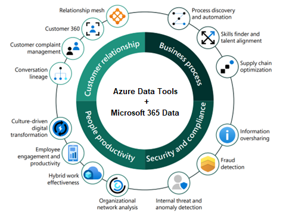
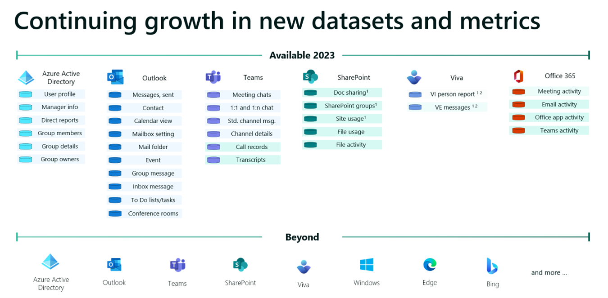
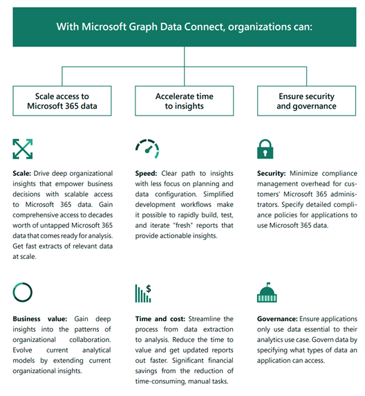
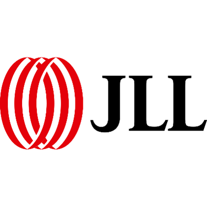
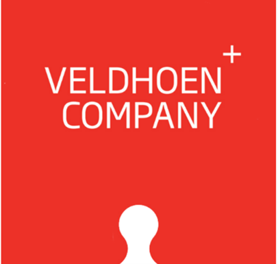
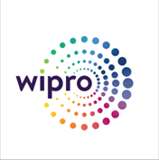

# Overview of Microsoft Graph Data Connect

In a hybrid workplace, organizations must dynamically evolve by implementing a data-driven culture. Today's organizations have an incredible amount of business data across applications and services in Microsoft 365.
 
While the potential this data holds is powerful, organizations must first unlock scale access to their Microsoft 365 data and streamline manual analytical processes to remain competitive.  We live in a world where your data is your competitive advantage. 

To access your Microsoft 365 data in the Microsoft Graph for enterprise analytics, you can use [Microsoft Graph Data Connect](https://developer.microsoft.com/graph), a secure, scalable solution that enables you to access relevant Microsoft 365 datasets incuded in Microsoft Fabric, Azure Synapse, and Azure Data Factory. 

Here are some of the enterprise analytics scenarios that are possible: 

- **Customer relationship analytics.** For commercial business leaders, go beyond traditional customer relationship management (CRM) insights and understand customer interactions and relationships based on communication and collaboration patterns.
- **Business process analytics.** For better operations, see how work really flows through the organization on a day-to-day basis. Pinpoint the manual processes and workflow bottlenecks that should be automated or optimized.
- **Security and compliance analytics.** To secure sensitive data, learn how employees are using and sharing sensitive information. Implement anomaly detection, threat intelligence, audit log analysis, risk management, and legal forensics.
- **People productivity analytics.** For driving transformation, export your [Microsoft Viva](/viva/microsoft-viva-overview) productivity metrics, so you can convert insights into solutions with digital adoption, smart meetings and content, hybrid workplaces, and cultural change.

## Breadth and depth of Microsoft 365 data

In the following diagram, you can see various types of Microsoft 365 data that organizations get though Microsoft Graph Data Connect. There are datasets available from a wide variety of Microsoft 365 sources, including Azure Active Directory, Outlook, Teams, SharePoint, Viva Insight, and Microsoft Groups—and the list is growing. 

Learn more for the full list of datasets we offer at Microsoft Graph Data Connect: [Datasets, regions, and sinks supported by Microsoft Graph Data Connect](/graph/data-connect-datasets).

<!--- Update image above with more current one per Rishi
-->
Microsoft 365 datasets come ready for analysis. You can have data delivered in the following categories:  

- **Basic datasets:** Datasets generated from raw customer created content and inputs from Microsoft 365 applications and services. 
- **Cleaned datasets:** Datasets generated by either normalization and de-duplication from basic datasets. This can also include datasets created from user activity or behavior signals in Microsoft 365.
- **Curated datasets:** Datasets custom generated for a specific use case or analytics scenarios. This can also include datasets from other Microsoft organizations (Viva Insights, SharePoint, and so on) on Microsoft 365 analytics application for their extensibility.

### Who gets value from Microsoft Graph Data Connect?

- **LOB business leaders** need actionable insights from Microsoft 365 data because it helps them make informed decisions regarding their organization. By analyzing data, they can identify patterns and trends including customer relationship analytics, business process analytics, security and compliance analytics, and people productivity analytics.
- **Data engineers** collect, process, and transform Microsoft 365 data from Microsoft Graph Data Connect into a format that is usable by data scientists and analysts. They construct and manage Microsoft 365 data pipelines as data combined across other data sources in Microsoft Fabric, all while ensuring the highest levels of data quality and consistency. 
- **Data scientists** and **data analysts** play a critical role in helping LOB business leaders make sense of their data and use it to drive business decisions. Data analysts identify trends, patterns, and insights. They analyze Microsoft 365 data from Data Connect data and create reports to make informed decisions. They may also be responsible for creating dashboards and visualizations to communicate their findings. Data scientists build highly accurate, predictive models and algorithms based on the petabytes of available Microsoft 365 data from Data Connect. They use machine learning to analyze data and make predictions about future outcomes.

## Get started 

Getting started with Microsoft Graph Data Connect is easy! 

Simply follow the following the steps at [Build your first Microsoft Graph Data Connect application](/graph/data-connect-quickstart?tabs=AzureSynapsePipeline%2CMicrosoft365):

1. Set up your **Microsoft 365 tenant and enable Microsoft Graph Data Connect**.
2. Set up your **Azure Active Directory app registration**.
3. Set up your **Azure Storage resource**.
4. Set up your **Azure resource with Azure Synapse or Azure Data Factory**.
5. Monitor data consent requests with **Microsoft 365 Admin Center or PowerShell**.

And congratulations, you’re all ready to go!

## Why choose Microsoft Graph Data Connect?

### Scale access to Microsoft 365 data 

1. Gain deep insights into the patterns of organizational collaboration.
2. Make use of a unified, single source of truth with open and governed data lakehouse.
3. Perform interactive analysis directly in a data lake without the need for data migration.
4. Empower data and business users to make more informed and accurate data-driven decisions.

Learn more about features with Microsoft Graph Data Connect: [Scale access to Microsoft 365 data with Microsoft Graph Data Connect](https://devblogs.microsoft.com/microsoft365dev/scale-access-to-microsoft-365-data-with-microsoft-graph-data-connect/)

## Accelerate time to insights

Browse through a gallery of templates that provide the necessary Azure resources, data pipelines, and user experience samples to accelerate the path to realizing the value of the M365 data. Learn more about [Microsoft Graph Data Connect templates](/graph/data-connect-templates-overview):

Templates help take use cases from hypothesis to implementation in four steps:

1. Aggregate and analyze large volumes of data within minutes.
2. Simplify development workflows to rapidly and easily build, test, and iterate.
3. Automate processes to reduce the need for time-consuming, manual processes.
4. Visualize data without the need for complex report configuration.

<!--- Learn more about the streamlined consent flow and approval: TBD
-->

### Secure your data with Microsoft Graph Data Connect

1. See persistent data governance in a single view with [Microsoft Purview](/purview/purview). 
2. Minimize compliance management overhead by specified detailed compliance policies for applications and users.
3. Follow the industry standard for data privacy and confidentially, with support for critical data protection regulations such as GDPR and HIPAA.

Learn about our security, governance, and privacy: [Security, governance and privacy built into Microsoft Graph Data Connect](https://devblogs.microsoft.com/microsoft365dev/security-governance-and-privacy-built-into-microsoft-graph-data-connect/)

<!--- Read our detailed e-book about our out-of-the box capabilities: MGDC governance, security, privacy eBook_VFinal.pdf (link provided is SharePoint restricted)
-->

Now you can bring all your Microsoft 365 data into [Microsoft Fabric](/fabric/get-started/microsoft-fabric-overview). Microsoft 365 Data Integration for Microsoft Fabric is a feature of the new Microsoft Fabric solution, which enables you to manage your Microsoft 365 alongside your other data sources in one place. This solution offers you a suite of analytical experiences that seamlessly work together to transform your data into a competitive advantage.

To learn more about Microsoft Graph Data Connect integration with Microsoft 365 Fabric:

- Microsoft 365 + Fabric Launch Event Video: [https://youtu.be/1o_QDFq6gzE?t=10194](https://youtu.be/1o_QDFq6gzE?t=10194)
- Detailed Microsoft 365 + Fabric eBook: [Transform Your Microsoft 365 Data into Business Insights with Microsoft Graph Data Connect](https://info.microsoft.com/ww-landing-Unlock-Productivity-and-Collaboration-Insights-with-Microsoft-Graph-data_connect-and-Microsoft-Fabric.html)
- Microsoft 365 + Fabric Blog: [Microsoft 365 Data + Microsoft Fabric better together](https://blog.fabric.microsoft.com/blog/microsoft-365-data-microsoft-fabric-better-together/)

## Microsoft 365 data integrations

Microsoft Graph Data Connect is integrated with many Microsoft services. 

Here are the services that are now available:

- Microsoft 365 Data + [Microsoft Fabric](https://aka.ms/microsoft-fabric) 
- Microsoft 365 Data + [Azure Synapse Analytics](https://azure.microsoft.com/products/synapse-analytics/) 
- Microsoft 365 Data + [Azure Data Factory](https://azure.microsoft.com/products/data-factory/) 
- Microsoft 365 Data + [Microsoft Viva Insights](https://www.microsoft.com/microsoft-viva/insights)
- Microsoft 365 Data + [Microsoft Syntex](https://www.microsoft.com/microsoft-syntex)

## Microsoft Graph Data Connect customer and partner stories

**Customers.** Read about how Microsoft Graph Data Connect customers build enterprise analytics to empower their organizations.

| Logo        | Description |
| ----------- | ----------- |
|    | **JLL:** Learn more about how JLL gives their sales teams a holistic view of client relationships: [Microsoft Customer Story-JLL gives sales teams a holistic view of client relationships with Microsoft Graph Data Connect](https://customers.microsoft.com/story/1640464050423914642-jll-professional-services-microsoft-graph-data_connect) |
|  | **Politecnico di Milano:** Learn more about how universities use Microsoft Graph Data Connect to research actionable workforce sentiment insights: [Microsoft Customer Story-Politecnico di Milano delivers actionable workforce sentiment insights with Microsoft Graph Data Connect](https://customers.microsoft.com/story/1635023177515744184-politecnico-di-milano-higher-education-microsoft-graph-data_connect) |
|    | **Sura:** Companies like Sura are using Microsoft Graph Data Connect to help businesses reduce human resources risk: [Microsoft Customer Story-Seguros SURA Latinoamérica to help businesses reduce strategic human resources risk with Microsoft Graph Data Connect](https://customers.microsoft.com/story/1602468095350437521-suramericana-insurance-microsoft365) |
|    | **G&J Pepsi-Cola Bottlers:** Learn more about Pepsi as they reflect on overcoming ransomware attacks and offer insights from the other side: [Microsoft Customer Story-G&J Pepsi reflects on overcoming a ransomware attack, offers insights from the other side](https://customers.microsoft.com/story/1548796714270598782-gjpepsi-consumer-goods-microsoft-security-solutions) |

**Partners.** Read about how Microsoft Graph Data Connect has collaborated with a rich network of enterprise technology vendors who have built powerful, joint solutions on Microsoft 365 data: 

| Logo        | Description |
| ----------- | ----------- |
|    | **GainX:** Build a comprehensive map of information flow and provide a data-driven, systemic view of how an organization is actually functioning: [Learn more](https://devblogs.microsoft.com/microsoft365dev/maximizing-organizational-performance-with-gainx-artificial-intelligence-and-microsoft-graph-data-connect/) |
|    | **HCL:** Conduct better workforce management, performance analysis, and improvement measures to understand employee productivity. |
|    | **Infosys:**  Gather feedback, identify areas for improvement, and take action to improve employee engagement, productivity, and retention. |
|    | **Lotis Blue:** Utilizing organizational network analysis (ONA) to enhance diversity, equity, and inclusion outcomes. Also applying ONA principles to improve customer relationships and revenue velocity. |
|    | **Neo4j:**  Construct security and compliance analytics to uncover the hidden patterns of communication in your organization. [Learn more](https://www.youtube.com/watch?v=no6iWuswR0c&list=PLWZJrkeLOrbaSmfaIM6ogv-LQUP0tleTw).  |
|    | **Neudesic:** Extensibility of Microsoft 365 data and Viva Insights collaboration metrics into customer’s Azure environment to further display relevant metrics for employees within other systems and portals. |
|    | **Parabole:** Illustrate true cost to maintain the channel, time spent with partners by product, and mismatches between partner investment & partner value. |
|    | **TLC:** Identify patterns and trends in employee behavior during weekends. Gain insights into how weekend working affects overall employee happiness scores. |
|    | **Veldhoen:** Facilitate collaboration and connections between various business units within the company as a way to drive innovation. |
|    | **Wipro:** Wipro: Enable your organization to effectively manage and classify data classification during mergers, acquisitions, and divesture scenarios. |

## Pricing 

Microsoft Graph Data Connect consumption charges are billed using Azure subscriptions. Details on pricing rates can be found here on the official webpage: [Pricing - Microsoft Graph Data Connect](https://azure.microsoft.com/pricing/details/graph-data-connect/). 

Read more about our recent [Microsoft Graph Data Connect pricing updates](https://devblogs.microsoft.com/microsoft365dev/microsoft-graph-data-connect-pricing-updates-2).

## See also

- [Build your first Microsoft Graph Data Connect application (tutorial)](data-connect-quickstart.yml)
- [Data Connect frequently asked questions](data-connect-faq.md)
- [Datasets, regions, and sinks](data-connect-datasets.md)
